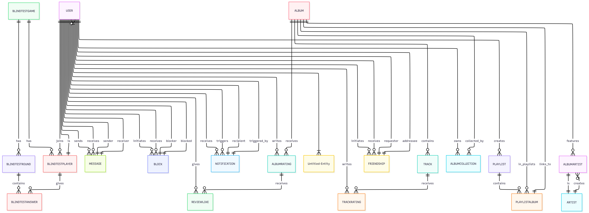
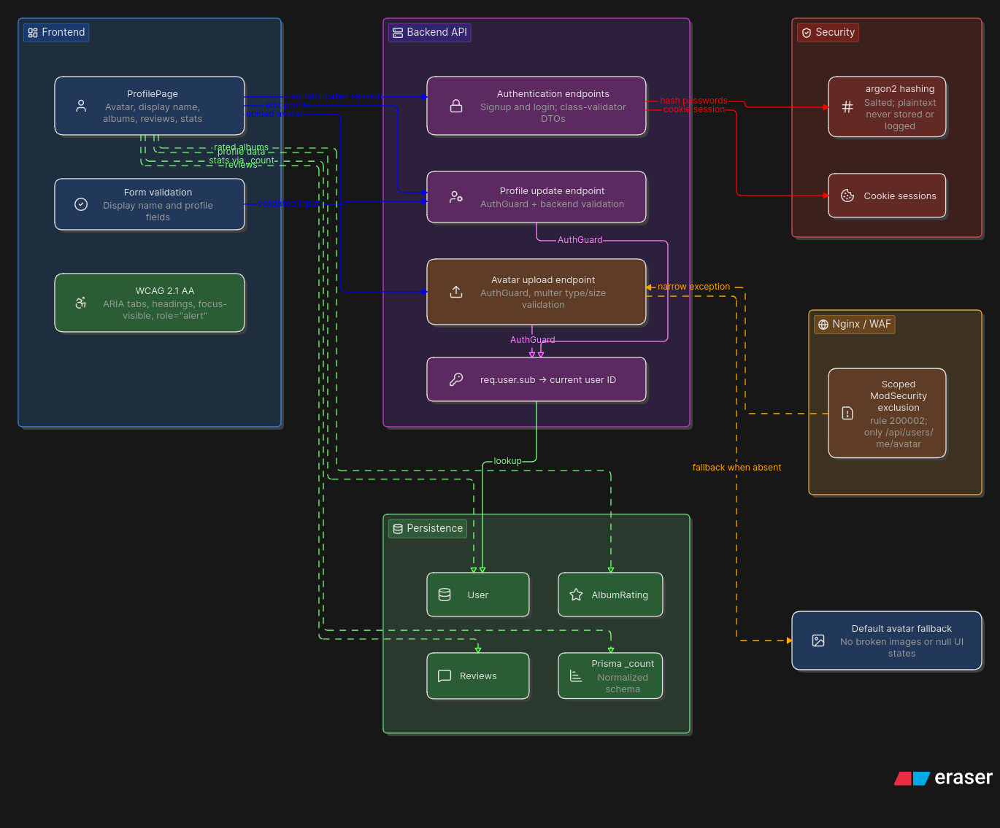
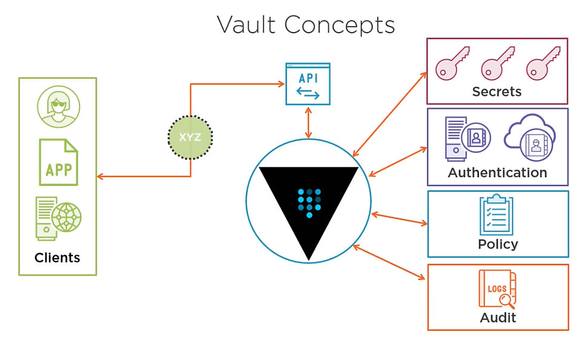
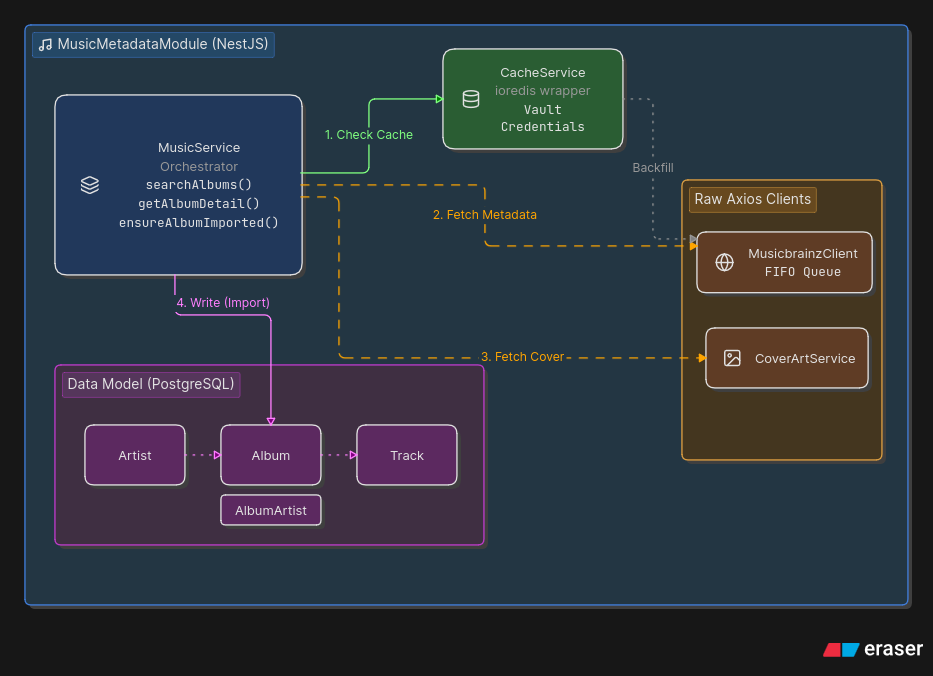

*This project has been created as part of the 42 curriculum by a team of 4 students.*

---
# Table of Contents

1. [Description](#description)
2. [Instructions](#instructions)
3. [Resources](#resources)
4. [Team Information](#team-information)
5. [Project Management](#project-management)
6. [Technical Stack](#technical-stack)
    - [Technologies and frameworks used](#-technologies-and-frameworks-used)
    - [Technical choices](#-technical-choices)
    - [Infrastructure & Stack Choices](#-infrastructure--stack-choices)
7. [Database Schema](#database-schema)
8. [Features List](#features-list)
9. [Modules](#modules)
    - [How each module was implemented](#how-each-module-was-implemented)
    - [List of all chosen modules, point calculation & which team member(s) worked on them](#list-of-all-chosen-modules-point-calculation--which-team-members-worked-on-them)
10. [Individual Contributions](#individual-contributions)
11. [Additional Information](#additional-information)

---


---

# Description

**Record** is a social platform for people who enjoy music and building community around it. It allows users to add their favourite music to their personal collection, rate albums, share their thoughts with friends and wholly express their love for music.

- Manage your profile
- 'Rec' an album and add it to the playlist that suits its mood best
- Follow your friends activity
- Chat with your friends
- Play alone or with friends to test your musical knowledge

---

# Instructions

This project requires Docker (engine + CLI + Compose plugin) to be installed and configured on your machine.

### Launching the project

1. Clone the repository:
```bash
git clone   git@vogsphere.42paris.fr:vogsphere/intra-uuid-e1da16e2-c9d2-497a-a3c8-06cda5bc84ae-7580150-login
cd  <cloned repo>
```

2. From the project root, run:
```bash
make up
```

3. Once the build is complete and all containers are `Healthy`/`Started`, access the site via: `https://localhost:8443`

### Commandes utiles

- `make down` — stops and removes containers
- `make re` — full cleanup, rebuild, and restart
- `make ps` — container status
- `make logs` — live logs
- `make demo` — enables the demo mode by setting up 4 users
- `make inside-backend` / `make inside-frontend` / etc. — opens a shell inside the relevant container
---

# Resources
#### Useful documentation

- [NestJS — Gateways (documentation officielle)](https://docs.nestjs.com/websockets/gateways)
- [NestJS — Exception Filters / Guards for WebSockets](https://docs.nestjs.com/websockets/exception-filters)
- [Socket.IO — Rooms](https://socket.io/docs/v4/rooms/)
- [How do APIs work ? - Cloudflare](https://www.cloudflare.com/learning/security/api/how-do-apis-work/)
- [Deezer for Developers](https://developers.deezer.com/)
- [Deezer API — FAQ développeurs](https://support.deezer.com/hc/en-gb/articles/360011538897-Deezer-FAQs-For-Developers)
- [Prisma — Schema reference](https://www.prisma.io/docs/orm/reference/prisma-schema-reference)
- [react-i18next — Getting started](https://react.i18next.com/getting-started)
- [Owasp modsecurity project](https://modsecurity.org/)
- [Health check system](https://medium.com/@tbobm/complete-health-checks-and-why-they-matter-8b2120d86e4f)
- [Accessibility compliance — WCAG 2.1](https://www.dpi.nc.gov/about-dpi/technology-services/digital-accessibility/wcag-21-level-aa#Perceivable-5776)

#### AI usage

AI was used throughout this project strictly as a learning tool — to understand core concepts (how they work). No code was generated by AI; all implementation was written manually.
It was also used for translation.  Do some advanced testing.

---

# Team Information
**Project Manager (PM) / Scrum Master →** *jesstava*
- Organizes team meetings and planning sessions
- Tracks progress and deadlines
- Ensures team communication

**Project Manager (PM) / Scrum Master →** *tn***
- Facilitates team coordination and
removes obstacles
- Manages risks and blockers

**Product Owner (PO)→** *ni****
- Validates completed work
- Communicates with stakeholders (evaluators, peer)

**Technical Lead / Architect→** *sp***
- Defines technical architecture
- Makes technology stack decisions

---

# Project Management

◦ We held an initial meeting to divide up tasks and roles and share our respective ideas for the site, followed by a few other meetings on Fridays for weekly check-ins. Communication took place mainly via messaging (Discord), and our Google Doc was frequently updated.

◦ We used Google Docs to track the project's progress. Each group member had a dedicated tab to describe their progress, the necessary documentation for the modules they were working on, and the relevant resources.

◦ We primarily used Discord to communicate with one another. The platform is easy to use and allowed us to create a server for our project, ensuring that every bit of progress was noted in the relevant channels.

---

# Technical Stack

#### ◦ Technologies and frameworks used

The frontend was built with React.js and Tailwind CSS, while the backend was developed using NestJS, a progressive Node.js framework built with and fully supporting TypeScript. As for the Database, *Record* uses PostgreSQL, an open-source object-relational database management system.

#### ◦ Technical choices

Why have we chosen NestJS as a server-side framework?

- *Maintainability & scalability*;  NestJS makes it easy to organise applications into modules, components, services and controllers, which helps with code maintainability. This allows us to isolate and refactor specific parts of the application without affiching areas, which is best for teams working on different features and functionality in parallel
- *Typescript*; it uses Typescript at its core, which is a safe, robust codebase with early error detection
- *Middleware and guards*; NestJS provides middleware and guards, which allow us to intercept incoming requests and apply pre-processing logic before they reach the controllers. These guards are useful for authentication  mechanisms

This facilitated the choice of a frontend framework since they do work really well and smoothly together.  React is a free and open-source front-end JavaScript library that aims to make building user interfaces based on components more "seamless", and we paired it with Tailwind CSS for fast, responsive and consistent styling. Node.js is ideal for creating server-side logic and managing data efficiently, while React excels at developing dynamic and interactive user interfaces.

About the database, we chose to use a relational model to enjoy the ACID rules (*atomicity, consistency, isolation, durability*). PostgreSQL is primarily an Object-relational Database Management System that ensures maximum ACID compliance, but it also employs some concepts from object-oriented systems. Besides, Prisma ORM was chosen for its excellent integration with NestJS and PostgreSQL, providing type-safe database queries, simplified schema migrations, and improved developer productivity.

Finally, all these technologies possess extensive documentation and a large community to make it accessible.

#### ◦ Infrastructure & Stack Choices
We chose **Docker** as a containerization solution because it enables packaging and running an application in a loosely isolated, secure environment called a container.
Every service—Vault, PostgreSQL, Redis, the NestJS backend, nginx, and the backup daemon—runs in its own container with its own Dockerfile and health check.

**✽ Why two networks?**

We split the Docker Compose network into two, ensuring that Vault is accessible only through the backend network and enhancing security within the stack.

- `network-frontend;`frontend + nginx
- `network-backend;` backend, nginx,postgres, vault, redis

The services using the backend network are reachable only from other containers on this private network as they expose no ports.

Nginx is the only service attached to both networks, acting as the single controlled bridge between the public-facing side and the backend services. This ensures that even if the WAF/ModSecurity layer were bypassed, the database, cache, and secrets store are not directly reachable from outside the backend network.

**✽ TLS, HTTPS, secure connection?**

The main connection is secure, relying on TLSv1 and 2 TLSv1.3, which means all API calls and connections are using HTTPS.

- **nginx/browser;** HTTPS only on port 8443, using a certificate by Vault’s PKI engine—there is also no silent HTTP fallback thanks to the port 8080 redirection to https://:8443$host
- **nginx/backend;** internal, HTTP since the backend container has no published port and is unreachable except from containers already on network-backend
- **backend/postgres/redis/vault;** same private network,

HTTPS is enforced from the browser to nginx.  Internal service-to-service traffic relies on Docker network segmentation rather than end-to-end TLS, since these services are never reachable from outside network-backend.

**✽ Why these specific services?**

* `Vault;` centralises secrets (database credentials, Redis password…) and issues the TLS certificate nginx uses
* `nginx;` reverse proxy, TLS termination, and ModSecurity WAF enforcement point
* `postgres;` relational store for users, albums, ratings, playlists
* `redis;` cache layer for a smooth and responsive app
* `backup;` automated Postgres backups + disaster recovery for required by the DevOps module (healthcheck + automated backups)

---

# Database Schema

Our database uses PostgreSQL with Prisma ORM as a schema.  The design has three main sections;

- **user management / social data;** accounts, friendships, messages, notifications, blindtest
- **music metadata;** artist, album, track, all sourced from Music Brainz + Cover Art Archive 
- **user-generated content;** rating, reviews, collections, playlists that links the two together via FK

The metadata for music 'Album/Track/Artist' rows are created lazily only the first time a user ratesm, reviews or collects an album.  The albums are stored with a unique `mbid`. Two rating modes exist, either `AlbumRating` or `TrackRating`, which then triggers the `isAutoRate` rating calculation.

**Data types**

- IDs; `Int @id @default(autoincrement())`
- External refs (MusicBrainz): `String @unique` (`mbid`)
- Timestamps: `DateTime @default(now())`
- Ratings: `Float` (for half-stars)



---

# Features List

Below is a detailed breakdown of all implemented features, their functionality and who worked on them.

#####  ◦ A real-time friends system → *tn****

*Record* lets users search for other members, send and repsond to friend requests, and block/unblock unwanted contacts. Friend status (acceptance, removal) propagate in real time via Websocket, so both users always see an up-to-date friends list without needing to refresh the page.

##### ◦ Real-time chat with rich message types → *tn****

Users can message their friends directly through a dedicated chat interface built on Socket.IO. Beyond plain text, the chat supports online/offline presence indicators, a live "is typing..." indicator, and read and receipts. Conversations also support rich message cards: users can share an album directly from the music catalogue, or send a Blind Test game invite, both rendered as interactive cards instead of plain text.


##### ◦  Notification System → *jesstava*
The notification system keeps users informed of relevant activity
(friend requests, messages, social interactions around their reviews)
without requiring them to actively check every page. It also
demonstrates an event-driven architecture pattern, decoupling
business logic (friends, chat, ratings) from notification persistence.


##### ◦ Search through an extensive collection of music (albums, EPs, singles) → *sp*****

*Record* allows users to dynamically search through an extensive collection of music inside the *Music Brainz / Cover Art* database that is directly incorporated into the backend, thanks to the *Music Brainz / Cover Art* API. Users can type in a title, artist, album title, EPs or singles, then retrieve basic metadata about it (release group, date and artist).


##### ◦ Add digital music to a playlist or a collection → *sp***

*Record* allows users to visually keep track of their favourite music to make it engaging and more personalised. The collection is a personal feature, similar to real collection of CDs or vinyls, while playlists can be public and visible to friends.


##### ◦ A custom and unique rating system → *sp***

To guarantee authenticity and full expression of personal taste, *Record* lets users rate music through two different process; as a whole, or track by track for those who pay attention to details in each song and want an honest rating. Reviews are optional, and other users can like these 'Recs' to show appreciation. Notifications allow friends to easily interact with each others' recs (cf. Notifications).


##### ◦ A blindtest where you can play alone or with friends → *ni*****

*Record* allows users to play a blindtest either solo or with people from their friends list. It features ten 15-second rounds to test everyone's knowledge across a variety of musical genres.


##### ◦ Blindtest duo invitation by message → *t\**** & *n\****

Each blindtest can accommodate up to 10 players, but a user can also choose to play by directly inviting a friend via their chat. The game will then start with only the two people involved in the invitation.

---

# Modules

Modules were chosen according to the project's needs, as well as for enjoyment. The goal was to learn new technologies, understand web development, gain confidence working on bigger group projects, get more familiar with *Git* and collaborative work, all while having fun.

### How each module was implemented

<details>
<summary>Web</summary>


**✽ Use a framework for both the frontend and backend**

◦ Use a frontend framework (React, Vue, Angular, Svelte, etc \
◦ Use a backend framework (Express, NestJS, Django, Flask, Ruby on Rails,
etc.) \
◦ Full-stack frameworks (Next.js, Nuxt.js, SvelteKit) count as both if you use
both their frontend and backend capabilities

**✽ Implement real-time features using WebSockets or similar technology**

◦ Real-time updates across clients \
◦ Handle connection/disconnection gracefully \
◦ Efficient message broadcasting

**✽ Allow users to interact with other users**

◦ A basic chat system (send/receive messages between users) - extended with real(time presence, typing indicators, read receipts, and rich message types (album sharing, game invites)) \
◦ A profile system (view user information) - public profile pages woth recent activity, favorite albums, and friends list, plus a personal editing panel (avatar, bio, display name) \
◦ A friends system (add/remove friends, see friends list) - friend requests, blocking, and real-time synchronization across both users via WebSocket

**✽ Use an ORM for the database**

◦ *Record* uses **Prisma** as its Object-Relationnal Mapping (ORM) layer between the NestJs backend and the PostgreSQL database.

Why use an ORM, and why Prisma specifically:
- *type safety*; Prisma generate a fully-typed client directly from the database schema, so every query is checked at compile time - a typo in a field name or mismatched relation fails the build instead of silently breaking at runtime
- *schema-as-source-of-truth*; the entire database structure (models, relations, contraints, indexes) lives in a single declarative file(`schema.prisma`), making it easy to review, version, and reason about the data model as a whole, rather than piecing it together from scattered SQL migration files
- *NestJS integration*; Prisma's generated client integrates cleanly with NestJS's dependency injection system, letting any service inject qudn query the database without extra boilerplate

Implementation

In this project, `schema.prisma` defines all core models - `User`, `Song`/`Album`/`Artist`/`Track`, `Rating`, `Friends`, `Block`, `Message`, `Playlist`, and `BlindTest` - along with their relations (one-to-many, many-to-many through join tables like `AlbumArtist` and `PlaylistAlbum`) and unique constraints (e.g a user can only rate a given album once, or send one pending friend request to the same person).

The Prisma Client is instantiated once via a dedicated `PrismaModule`, using a `useFactory` provider that builds the database connection URL dynamically from credentials fetch and runtime from **Vault** - rather than a static `.env` file - keeping the database credentials consistent with the project's broader secrets-management approach.

Schema changes are applied through two distinct Prisma commands depending on context: `migrate dev` is used locally to generate a new migration file whenever the schema changes, while `migrate deploy` runs automatically in the backend container's entrypoint script on every startup, applying any pending migration without ever prompting for confirmation - making the database schema self-healing across environments and team members without manual intervention.  

**✽ A complete notification system for all creation, update, and deletion actions**

Decoupling via the @nestjs/event-emitter event emitter (EventEmitterModule.forRoot(), registered once at the root of app.module.ts) 
Each service (FriendsService, ChatGateway, RatingService) emits a generic event; NotificationsService listens and persists it. This decoupling prevents business logic (friendship, chat, rating) from being coupled to notification logic—a business service does not need to know that a notification exists in order to function.

</details>

<details>
<summary>Accessibility and Internationalization</summary>

**✽ Complete accessibility compliance (WCAG 2.1 AA) with screen reader support, keyboard navigation, and assistive technologies**

This module aims to achieve WCAG 2.1 Level AA compliance, with a particular focus on:
Support for screen readers (NVDA, VoiceOver),
Full keyboard navigation,
Compatibility with assistive technologies in general.
WCAG is organized around four principles (P-O-U-R): Perceivable, Operable (keyboard-accessible), Understandable, and Robust (compatible with assistive technologies). Each fix listed below addresses one or more of these principles.

**✽ Support for multiple languages**

As language-learning lovers ourselves, we wanted to have fun with a platform that supports multiple languages.🐝

Internationalization (i18n) is the process of enabling an application to be easily adapted to various languages and locales. `Record` supports three languages: English as the default, French, and Japanese. In order to handle this smoothly, we used a powerful React library called `react-i18next` that enables dynamic language switching.🐝

Our language switcher is accessible throughout the entire navigation, via the footer. All user-facing text is translatable, as well as the accessibility services.🐝

**✽ Support for additional browsers**

We chose to make Record compatible with addtional browsers; Firefox and Brave to guarantee users with different browsers to enjoy all functionalities.🐝

Besides, we ran different tests on these three browsers and found no particular browser-specific limitations aside from Chrome allowing more shrinking on devtools.🐝

</details>

<details>
<summary>User Management</summary>

**✽ Standard user management and authentication.**

We chose this module so that users can have a standard user management and authentication, as well as some additional personalisation features.

**Implementation**

- *registration;* standard email/password signup and login, backend-validated with `class-validator` DTOs
- *password security;* passwords are hashed with **argon2** (salted, never stored or logged in plaintext)
- *sessions;* Record sessions are cookie-based , consistent with the rest of the app's auth pattern (`AuthGuard` protecting all authenticated routes, `req.user.sub` for the current user's ID)
- *profile update;* authenticated users can edit their profile information (display name, & bio.) through a dedicated backend endpoint, with both frontend and backend validation
- *avatar upload;* avatars are handled via `multer` on the backend, protected by `AuthGuard` in addition to file-type/size validation. Users without a custom avatar automatically fall back to a default avatar
- *dedicated profile page;*  display of the user's information—avatar, display name, rated albums, playlists (public/private)..

The avatar upload endpoint required a narrowly-scoped `modsecurity off` exclusion in nginx (rule 200002, a known ModSecurity v3 bug that breaks multipart uploads regardless of file size). The endpoint remains protected by `AuthGuard` and multer validation, so disabling the WAF there doesn't weaken the app's overall security posture. 

- *bidirectional relationship modleing*; rather than a simple symmetric many-to-many table, friendships are tracked through a`requester`/`addressee` pair with an explicit status (`PENDING`, `ACCEPTED`, `DECLINED`), making it possible to know who initiated a request and to correctly display "waiting for response" versus "wants to be your friend" states
- *blocking is independent from friendships*; blocking is modeled as its own entity, separate from `Friendship`, so a user can be blocked without ever having been friends, and a block always takes priority when checking wether two users can interact
- *real-time synchronization*; friend removal and requests reflect instantly on both ends without requiring a manual page refresh, by reusing the chat's existing WebSocket infrastructure rather than building a separate real-time channel

Implementation

The Friends system is modeled through two Prisma entities: `Friendship` (with `requesterId`, `addresseeId`, and a `status` enum) and `Block` (`blockerId`, `blockedId`), each with a unique constraint preventing duplicate requests or blocks between the same pair of users.

A dedicated `FriennsModule` exposes REST endpoints for sending, accepting, and declining requests, removing and existing friendship, blocking/unblocking, listing friends, pending requests, and block users. Before a friend request can be sent, the backend checks for an existing block in either direction and rejects he request accordindly. Blocking a user also automatically deletes any existing friendship between the two, since the two states are mutually exclusive.

On removal, the backend determines which are the two users didn't initiate the action and, if they currently connected pushes a `friendRemoved` event through the existing chat WebSocket Gateway - this lets the other user's friends list refresh automatically in real time, without needed a dedicated WebSocket channel just for this feature.

On the frontend, the friends page is organized into four tabs (Friends, Requests, Blocked, Find), with the debounced search that queries all users while excluding anyone already in the existing relationship(pending accepted or blocked) - this prevents sending a duplicate request to someone already added, avoiding the resulting `409 conflict` from either surfacing to the user. 


//-🐝
**✽ User activity analytics and insights dashboard**

*Record*  allows users to get an overview of their activty and insights on their taste directly on their profile panel. This is the result of a `getStats` request that fetches several statistics for a user;
- total number of  'Recs'
- the number of playlists created
- the number of albums in a collection
- the average rating the user has given (based on all ratings)

**Implementation**

It directly fetches data from Prisma.

```bash
this.prisma.albumRating.count({ where: { userId } }),
this.prisma.playlist.count({ where: { userId } }),
this.prisma.albumCollection.count({ where: { userId } }),
this.prisma.albumRating.aggregate({ where: { userId }, _avg: { score: true } }),
```
</details>

<details>
<summary>Cybersecurity</summary>

**✽ Implement WAF/ModSecurity (hardened)**

 A WAF (Web Application Firewall) is a type of firewall that protects a web server from cyberattacks. Businesses need a WAF that is effective, easy to use, and helps them achieve compliance.
The WAF examines every request sent to the server before it reaches the application to verify that the request complies with the firewall’s rules.
It operates at Layer 7 of the OSI model and protects against attacks at the application layer, such as SQL injection, file inclusion, cross-site scripting (XSS), and cookie poisoning.

ModSecurity :  is an open source, cross-platform WAF (Web Application Firewall) module. Known as the “Swiss Army Knife” of WAFs, it enables web application defenders to gain visibility into HTTP(S) traffic and provides a power rules language and API to implement advanced protections.

**Why NGINX with ModSecurity ?**

NGINX must be the sole entry point, because the NEST.JS backend and the PostgreSQL database management system must not be directly exposed to the internet.

→  NGINX therefore receives all external traffic, filtering and redirecting it to the hidden internal services.
The classic NGINX reverse proxy simply routes traffic without examining the requests it receives, NGINX alone would allow any well-crafted or well-hidden attack to reach the backend.

→ ModSecurity therefore inspects the content of each request (parameters, headers, body) and compares it to a database of known attack signatures (the CRS, or Core Rule Set, which we configure) in the NGINX Dockerfile.
This is the WAF (Web Application Firewall) component, which serves as a defense against application-level attacks in addition to network attacks.


**✽ Implement HashiCorp Vault for secrets**

HashiCorp Vault* is an open-source tool designed to securely store, access and distribute sensitive information—digital certificates, database credentials, passwords, and API encryption keys—in a single, trusted location. The Vault server is the main service that stores and servers secrets.

**Why use Vault for security?**

- *prevent credential leaks*; teams often share credentials through .env files, which are easily exposed via Git or chat. Vault provides a single, secure access point for the whole team.
short-lived credentials; instead of static secrets that remain valid even after a breach, Vault issues automatically rotated, time-limited credentials that expire before they can be misused.
- *environment isolation*; Vault enforces context-based access controls, ensuring a breach in one environment cannot compromise another.
- *reduced human dependency*; as a centralised secret management hub, Vault automates secret handling, enabling safer and faster development.
- *compliance*; Vault automatically logs every access and change, guaranteeing compliance to security regulations.



**Implementation**

Vault 1.17 centralises every credential in the stack (Postgres, Redis, JWT signing secret, TLS certs) so nothing sensitive is hardcoded in images, compose files, or an `.env` file.  Each service authenticates to Vault at startup and fetches only what it needs. Storage backend is **Raft** (single node), with **KV v2** for static secrets and an internal **PKI** engine issuing short-lived TLS certs for nginx.

**Auth flow via AppRole**

Each service (nginx, backend, postgres, redis-bootstrap) gets its own **AppRole** with a least-privilege policy scoped to only its own secret path. `role_id`/`secret_id` are dropped into per-service Docker named volumes (`vault-nginx`, `vault-backend`, `vault-postgres`, `vault-redis`) at init time. 

On boot, each entrypoint script logs in via AppRole and gets a short-lived client token (`token_ttl=2h`) to read its secrets.

**Security**

Only `role_id`/`secret_id` are baked into volumes at deploy time; actual passwords never leave Vault except transiently, in memory, at each container's startup.

**Dashboard**

Thanks to the Vault web interface, we can easily navigate the service, access the KV and overview the configuration at `https://localhost:8200/ui/`. To access the dashboard, you can authenticate using the Vault Root Token.

</details>

<details>
<summary>Gaming and user experience</summary>


**✽ Implement a new game : Blind Test**

A blind test is a multiplayer music guessing game where players listen to short audio excerpts and must identify the track or artist among several proposed answers, without any visual cue beforehand — hence "blind." Adding a second game beyond the core Pong experience extends the gaming layer of the platform and gives users an additional, socially-driven way to interact through the app, reusing existing systems (friends, chat, real-time communication) rather than building an isolated feature.

Why build it this way?

- reuse existing infrastructure; the Blind Test plugs directly into the already-existing chat and friend systems for invitations, avoiding a parallel matchmaking system
- server-authoritative gameplay; all game-critical logic (correct answer, timer, scoring) lives exclusively server-side, preventing any client-side manipulation or cheating
- real-time synchronization; every player in a session sees the exact same game state at the exact same time, regardless of individual network latency
- persistence; every game, round, and answer is stored in the database, allowing for a full history and consistent scoring even if a player reconnects

Implementation

In this project, the Blind Test module is built as a dedicated NestJS module (`BlindtestModule`), following the same Service/Gateway pattern as the existing chat module, and communicates with clients over the same WebSocket infrastructure (Socket.IO).

Game data is modeled through four Prisma entities — `BlindtestGame`, `BlindtestPlayer`, `BlindtestRound`, `BlindtestAnswer` — persisting the full history of every session played.

Track selection relies on the public Deezer API, querying curated music genre charts (rather than free-text search) to ensure relevant, non-explicit, non-podcast content, and to introduce enough variety across rounds.

→ a player creates or joins a session (solo, or by inviting up to 9 friends through the chat) → the server assigns a host and tracks active players in real time → each round, the server picks a track, generates 3 decoy answers, and broadcasts a 30-second preview with a 4-choice QCM to the whole room → a server-side 15-second timer gates all answer submissions, rejecting any late response → once all 10 rounds are completed, the server computes and broadcasts the final leaderboard, excluding any player who left mid-game

On the frontend side, a dedicated React page consumes this WebSocket flow to render the game in real time: a circular countdown timer visually depletes as the round progresses, answer choices turn green or red the instant a submission is validated, and player/round counters stay pinned on screen throughout the session. The whole interface is fully internationalized (FR/EN/JA) via react-i18next, including server-side error messages mapped to translated strings.


**✽ Advanced chat features:**

◦ Real-time messaging via WebSocket (Socket.IO), authenticated through the existing JWT cookie - no separate login step required for the chat connection
◦ Online/Offline presence tracking, broacast to friends the moment a user connects or disconnects
◦ "Is typing..." indicator with debounce, automatically cleared after a short period of inactivity
◦ Read receipts (single/double checkmark), updated in real time as soon as the recipient opens the conversation
◦ Rich message types beyond plain text: albums can be shared directly in a conversation (pulling live data - cover, title, artists - from the music module), and Blind Test invites are sent as clickable game-invite cards rather than plain links


</details>


<details>
<summary>Devops</summary>


**✽ Health check and status page system with automated backups and disaster recovery procedures**


What is a System Health Check?

The health check module requires a health check system that verifies the actual status of critical application components, not just “the server is responding,” but “the server can actually perform its task” (in this case, communicating with the database). The system health check is the first of the three expected steps.

A System Health Check is a comprehensive evaluation process designed to assess the overall condition and performance of an organization’s IT infrastructure. It involves a thorough examination of various components, including hardware, software, network systems, and security protocols. The primary goal of these checks is to identify potential issues, vulnerabilities, and inefficiencies before they escalate into major problems that could disrupt business operations.System Health Checks typically encompass:

*  Hardware performance analysis
*  Software configuration reviews
*  Security settings audits
*  Network connectivity assessments
*  Data backup and recovery evaluations

A health check therefore makes it possible to determine not only whether the process exists, but also the actual status of the service:
*   Running (starting)
*   Running (healthy)
*   Running (unhealthy)

The container engine (Docker/Podman) performs this health check by running a command inside the container every n seconds.


Thanks to all of this, we can set up a readiness check to ensure that a container can start up or determine whether it still needs to wait: 

Liveness Checks: Ensuring the Application is Running

A liveness check determines whether the application process is alive and capable of serving requests. This is what most standard health checks do-they simply confirm that the service is reachable and responding to HTTP requests.

Readiness Checks: Ensuring the Application is Ready to Handle Traffic

A readiness check is a more advanced health check that verifies whether the application is fully initialized and ready to serve traffic. It does not just check if the process is running but also ensures all dependencies (database, cache, external APIs) are in a good state.

**TESTING HEALTH CHECK SYSTEM**
On terminal : 
```bash
curl -k --resolve transcendence.local:8443:127.0.0.1 "https://transcendence.local:8443/api/health"
or visit the link https://localhost:8443/api/health
```

**What is the status page ?** 

Customers. Employees. End users. All of these groups (and more!) want to be notified when your service is down. Status page leverages dependable, redundant systems to make sure your audiences get the right message at the right time, every time.

Private or accessible ? 
→ Every company experiences downtime. Status page during that downtime to build customer trust via transparent communication. Automatically display your historical uptime and real-time system data with our Uptime Showcase and Public Metrics.

**TESTING STATUS PAGE** 
 Visit the link https://localhost:8443/status; each service and its status are displayed (Postgres is the only service that really needs an active, explicit check, since it’s the only one that can go down silently without the backend itself crashing—the backend can very well remain “up” in the sense of the process, while still being unable to communicate with the Postgres database.)
Active polling: The “Last checked” field updates every 15 seconds (status verified every 15 seconds).


**TESTING BACKUP AND DISASTER RECOVERY** 

1. Display all the  tables : 
```bash
podman exec -it postgres psql -U app_user -d transcendence -c "\dt"
```

2. Manual backup before the disaster test: 
```bash
podman exec -it backup /usr/local/bin/backup.sh
```

3.  Display the tables and their status (name before disaster) :
```bash
podman exec -it postgres psql -U app_user -d transcendence -c " SELECT 'Album' AS table_name, COUNT(*) FROM \"Album\" UNION ALL SELECT 'AlbumArtist', COUNT(*) FROM \"AlbumArtist\" UNION ALL SELECT 'AlbumCollection', COUNT(*) FROM \"AlbumCollection\" UNION ALL SELECT 'AlbumRating', COUNT(*) FROM \"AlbumRating\" UNION ALL SELECT 'Artist', COUNT(*) FROM \"Artist\" UNION ALL SELECT 'BlindtestAnswer', COUNT(*) FROM \"BlindtestAnswer\" UNION ALL SELECT 'BlindtestGame', COUNT(*) FROM \"BlindtestGame\" UNION ALL SELECT 'BlindtestPlayer', COUNT(*) FROM \"BlindtestPlayer\" UNION ALL SELECT 'BlindtestRound', COUNT(*) FROM \"BlindtestRound\" UNION ALL SELECT 'Block', COUNT(*) FROM \"Block\" UNION ALL SELECT 'Friendship', COUNT(*) FROM \"Friendship\" UNION ALL SELECT 'Message', COUNT(*) FROM \"Message\" UNION ALL SELECT 'Notification', COUNT(*) FROM \"Notification\" UNION ALL SELECT 'Playlist', COUNT(*) FROM \"Playlist\" UNION ALL SELECT 'PlaylistAlbum', COUNT(*) FROM \"PlaylistAlbum\" UNION ALL SELECT 'ReviewLike', COUNT(*) FROM \"ReviewLike\" UNION ALL SELECT 'Track', COUNT(*) FROM \"Track\" UNION ALL SELECT 'TrackRating', COUNT(*) FROM \"TrackRating\" UNION ALL SELECT 'User', COUNT(*) FROM \"User\" ORDER BY table_name; "
```

4. To keep better track of things, you might want to log user creation and the timestamp so you can compare them during recovery:
```back
 podman exec -it postgres psql -U app_user -d transcendence -c "SELECT id, username, \"createdAt\" FROM \"User\" ORDER BY id LIMIT 3;"
 ```

5. Simulate disaster : 
```bash
podman exec -it postgres psql -U app_user -d transcendence -c "DROP SCHEMA public CASCADE; CREATE SCHEMA public;"
```

6. Disaster confirmation : 
```bash
podman exec -it postgres psql -U app_user -d transcendence -c "\dt" --> should return “Did not find any relations.”
```

7. Backup restoration : 
```bash
podman exec -it backup /usr/local/bin/restore.sh
```

8. Recovery confirmation  : 
```bash
Relaunch step 3 and 4 ; should return the same result as before disaster
```

9. See created Backup : 
```bash
podman exec -it backup ls -lh /backups/
```
</details>

<details>
<summary>Modules of choice</summary>

**✽ Use of an external database**

Record's entire value depends on accurate, updated music metadata —artists, albums, tracklists, release dates, and cover art. Rather than self-seeding this
data (which would require us to build our own music database), we chose to source it live from **MusicBrainz** (the open-source music encyclopedia) & the **Cover Art Archive**, and persist only what users actually interact with.

**Why is it a major module?**

This was chosen as a Major module of choice because it goes  beyond simply calling a public API—it required designing a full data pipeline around a strict external
constraint, MusicBrainz enforces 1 request/second per IP, while keeping the app fast and never exposing that constraint to the user.

**The technical challenges & solutions**

  - *Hard external rate limit;* an internal FIFO request queue with an enforced minimum interval between calls to each guexternal API to respect the hard external rate limit without ever blocking or slowing down user-facing requests
- *Read-through caching layer;* Record uses a cache to keep music metadata. The flow goes as; `redis -> postgres -> musicbrainz` so that once data has been fetched, no user request ever waits on MusicBrainz again, it stays in the database
- *Lazy, idempotent import into PostgreSQL;* data is only persisted the first time a user actually rates an album/track or adds it to a collection —not on every search or page view— keeping the local database lean
- *Integration of MusicBrainz's data;* model MusicBrainz' data into our own nomrlaised Prisma schema

**Implementation**



The `MusicMetadataModule` (NestJS) has rate-limited MusicBrainz/Cover Art Archive clients (FIFO queue, 1001ms interval), a Vault-secured `ioredis` cache layer, and an orchestrator `MusicService` enforcing **cache → Postgres → external API, never the reverse** —searches and album details are read-through cached (1d/7d TTL), while `ensureAlbumImported` is the sole, idempotent Postgres write, triggered lazily only on a user's first rating or collection add. The schema stores canonical MusicBrainz IDs + a derived `releaseYear`, with cover art always hotlinked. Endpoints sit behind `AuthGuard`,  and Redis credentials come from Vault.

</details>


### List of all chosen modules, point calculation & which team member(s) worked on them
| Module | Implementation | Point    | Handled by |
| -------- | ------------ | :----: | --------|
| Internationalization |Accessibility compliance|2|jesstava
| Internationalization |Support multiple languages|1|all team
| Internationalization |Additional browsers|1|ni***
| Cybersecurity | WAF + Vault security |2|sp***, jesstava
| User |Auth + profiles + friends|2|tn***, sp***
| User |User activity analytics|1|sp***|
| Web |Framework (frontend & backend)|2|all team
| Web |WebSockets / real-time|2|tn***, ni***
| Web |Interactions with others users|2|tn***, jesstava, sp***|
| Web |ORM|1|tn***
| Web |Notifications system|1|jesstava
|Gaming |Complete web-based game|2|ni***
| Gaming |Base multiplayer game|2|ni***
| Gaming |Advanced chat features|1|tn***, ni***
| DevOps |Health check system|1|jesstava|
| Module of Choice | Use of an external database |2|sp***|
|||**27**|**TOTAL**|


✽ During this *ft_transcendence* project, each team member contributed to an average of 6.75 modules, for an average of 11 points brought to the total.

---

# Individual Contributions

<details>
<summary>sp****</summary>

**Implemented features and specific contributions:**

* Standard user management and authentication
* Use of an external database and data pipeline flow
* Credential and security management via Vault
* Debugging, ensuring the stack is coherent, clean and harmonised

**Challenges Encountered and Solutions:**

One of the biggest challenges was to make sure that the website would remain smooth and provide enough music metadata to be really enjoyable. I quickly found Music Brainz as a solution, and its implementation turned to be easier than I thought. It was imporant to respect the API rules, but a queue system and the use of cache guaranteed that we could rely on it to develop an application that entirely relies on external data.

</details>

<details>
<summary>jesstava</summary>

**Implemented features and specific contributions:**
- Accessibilty compliance across the platform to guarantee easy usage for all users.
- Notification system + notification bell on navbar to share events between friends.
- WAF to ensure security of the platform, guaranteeing SQL request scanning to Health check and status page system with automated backups and disaster recovery procedure to monitor the website services status and keep a backup if a disaster happens.

**Challenges Encountered and Solutions:**
It would have been better to add accessibility compliance before the implementation of frontend files without compliance. Doing it after implied a lot of changes, documentation, adaptations...
Elaborating a coherent color palet while verifying color contrast ratio.
Using as much extensions as possible, checking the navigator console accessibility while testing helped a lot. 


</details>

<details>
<summary>tn***</summary>

**Implemented features and specific contributions:**
- Set up Prisma ORM end-to-end in the project's Dockerized environnement, including secret management integration with Vault for the database connection string and JWT signing secret
- Implemented the Home page: a friends' activity feed, personalized album recommendations, and a custom-built infinite-scrolling hero carousel for trending albums
- Implemented the Explore page: trending-this-week and top-rated album frids backed by dedicated Prisma aggregation queries (`groupBy` on ratings), plus a "Surprise Me" random album feature
- Designed an implemented the Friends system end-to-end: friend requests (send/accept/decline), blocking/unblocking, and the underlying Prisma schema (`Friendship`, `Block` models with proper unique constraints)
- Built the real-time chat feature from scratch: NestJS WebSocket Gateway (Socket.IO) authenticated via the existing JWT cookie, message persistence (Prisma `Message` model), and conversation history endpoints
- Extended the chat with real-time presence tracking, a debounced "is typing..." indicator, and read receipts, all synchronized live between both participants
- Extended the chat further to support rich message types: in-chat album sharing (pulling live data from the music module) and Blind Test game invites, both rendered as interactive cards
- Built the public profile page (recent activity, favorite albums, friends list) and profile editing panel (avatar upload, bio, display name)
- Redesigned the navbar: centralized dropdown navigation with icons, an album search bar with persistent search history and keyboard navigation (arrow keys, Enter, Escape)
- Set up the internationalization pipeline with `react-i18next` (English, French, Japanese)
-Illustrated custom SVG icon sets (chat actions, navbar) to replace generic icon libraries, keeping a consistent visual style across the app
- Contributed to WCAG 2.1 AA accessibility compliance accros several pages (Friends, Chat, Profile) : color contrast fixes, `aria-label`s on icon-only buttons, keyboard focus management and focus traps in modals/dropdowns, and a skip-to-content link

**Challenges Encountered and Solutions:**
- **Friend removal requiring a manual page refresh**: the REST-only friends flow had no way to notify the other participant of a removal in real time. Solved by reusing the already-existing chat WebSocket Gateway to broadcast a `friendRemoved` event to the affected user's socket if they're online, triggering an automatic list refresh.
- **Prisma + Vault integration**: getting Prisma to reliably read its `DATABASE_URL` from secrets injected by Vault at container startup, rather than a static `.env` file, required careful ordering of the entrypoint script to ensure secrets were fetched and exported before Prisma's client initialization — a non-trivial amount of trial and error given the layered Docker/Vault/Prisma startup sequence.
- **Prisma migrations disappearing after container rebuilds**: newly generated migration files existed only inside the ephemeral backend container instead of persisting to disk, causing repeated schema drift between the database and the migration history. Fixed by adding a bind-mounted volume for the whole `prisma/` directory (not just `migrations/`) so both the schema and generated migrations stay in sync with the host filesystem.

</details>


<details>
<summary>ni***</summary>

**Implemented features and specific features:**
- Real-time multiplayer "Blind Test" game module (up to 10 players per game), integrated into the existing NestJS backend
- Automated round system: 10 rounds per game; 30-second music clips fetched via the Deezer API and filtered by genre to exclude irrelevant content (nursery rhymes, audiobooks)
- 4-choice multiple-choice question system (1 correct answer + 3 distractors) with server-side anti-cheat (the correct answer is never sent to the client before validation)
- 15-second timer per round, fully server-controlled to prevent late answers
- Scoring and final ranking system, persisted in the database (PostgreSQL via Prisma)
- Full game lifecycle management: creation, friend invitations via existing chat, automatic host designation/reassignment, and clean player exit during a game
- Dedicated React user interface: animated circular timer, immediate visual feedback (color-coded) on answers, game creation lobby (solo or multiple invitations), and full localization (FR/EN/JA) via i18next
- Logo design and icon designs (chat, blind test, explore, friends, and collections).

**Technical Stack:**
- Backend: NestJS, Socket.IO (dedicated WebSocket Gateway), Prisma ORM, Deezer API
- Frontend: React, TypeScript, Tailwind CSS, react-i18next

**Challenges Encountered and Solutions:**
- **Integer overflow (Int32) on Deezer IDs**: some track IDs exceeded the capacity of the PostgreSQL `Int` type. Resolved by migrating the affected field to the `BigInt` type.
- **Lack of musical diversity**: an initial implementation based on a fixed keyword search ("top") produced very homogeneous results. Replaced by a system that randomly selects from a list of genres using Deezer's genre-specific charts. - **Multiplayer round-sequence synchronization**: The automatic round progression logic—originally client-side and driven by a "host" player—posed a risk of duplicate rounds occurring due to simultaneous clicks. This logic was moved entirely to the server side to ensure a single, consistent game state for all players.
- **Player departure during a match**: This required rethinking the "host" role (originally a purely client-side concept) to make it persistent on the server, allowing for automatic reassignment upon departure without disrupting other players or skewing the final rankings.
- **Secret management via Vault**: Local database migrations required manually retrieving PostgreSQL credentials from Vault (rather than using a standard `.env` file), in accordance with the project's chosen security architecture.

</details>

---

# Additional information

Record posseses some known limitations;

- 1 req/second to MusicBrainz means that if the data isn't already cached, multiple users cannot fetch an album at the same time
- Covers depend on Cover Art Archive, so we rely on default covers to keep the website consistent still
